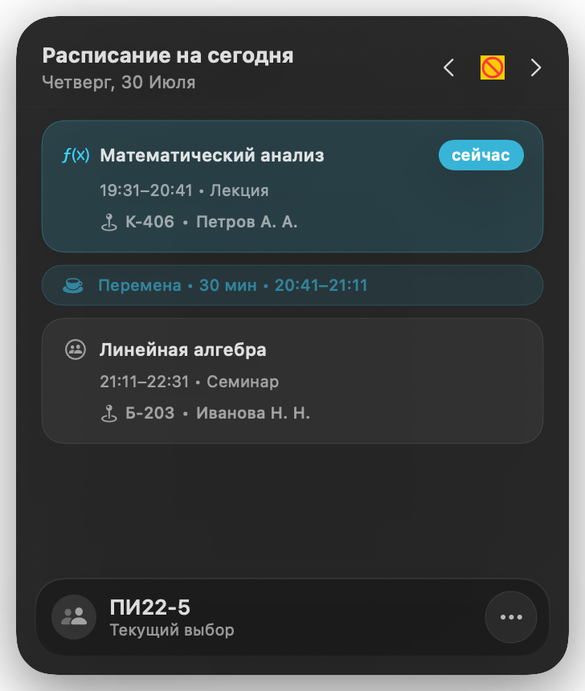
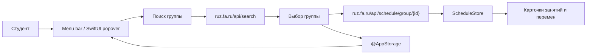

<div align="center">

# University Schedule for macOS

### Нативное menu-bar приложение для быстрого просмотра университетского расписания

**SwiftUI · macOS · ruz.fa.ru API**

</div>



## О проекте

Небольшое нативное приложение для macOS, которое живёт в верхней строке меню и
даёт студенту быстрый доступ к расписанию без браузера или отдельного большого
окна. Достаточно выбрать группу — приложение загрузит актуальные данные из
внешнего API [ruz.fa.ru](https://ruz.fa.ru) и покажет пары на выбранный день.

Проект сфокусирован на привычном для macOS сценарии: одно нажатие по иконке в
menu bar открывает компактный popover с расписанием.

## Что реализовано

- **MenuBarExtra:** приложение доступно из строки меню macOS;
- **поиск группы:** запрос к `ruz.fa.ru/api/search` и выбор нужного расписания;
- **загрузка актуальных данных:** асинхронные запросы к API расписания через `URLSession`;
- **сохранение выбора:** название группы и URL сохраняются через `@AppStorage`;
- **навигация по дням:** переход к предыдущему и следующему дню, ручное обновление;
- **умное представление расписания:** занятия группируются по времени, а перемены между ними рассчитываются автоматически;
- **контекст занятия:** время, тип пары, аудитория и преподаватель;
- **выделение текущей пары:** активное занятие видно сразу;
- **автообновление:** планировщик запрашивает данные при наступлении нового дня;
- **native macOS UI:** SwiftUI, Material/Glass-эффекты, светлая и тёмная темы.

## Как это работает



## Интерфейс

В popover отображаются:

- дата и заголовок «Расписание на сегодня»;
- кнопки перехода по дням и ручного обновления;
- карточки занятий с иконкой типа пары;
- плашка «сейчас» для текущей пары;
- информация о перемене;
- выбранная группа и меню для её смены.

## Стек

| Область | Технологии |
|---|---|
| Платформа | macOS 15.5+ |
| Язык | Swift 5+ |
| Интерфейс | SwiftUI, `MenuBarExtra`, Material / Glass effects |
| Данные | `URLSession`, внешний API `ruz.fa.ru` |
| Состояние | `ObservableObject`, `@Published`, `@AppStorage` |
| Модели | `struct`, `enum`, `Identifiable`, `Hashable` |
| Зависимости | Swift Package Manager, SwiftSoup |

## Структура

```text
UniversitySchedule/
├── UniversityScheduleApp.swift   # точка входа и MenuBarExtra
├── data/                         # данные для SwiftUI Preview
├── models/                       # занятия, аудитории, перемены и ScheduleStore
├── parser/                       # поиск группы и преобразование API-ответа
├── views/                        # popover, карточки занятий и стили
└── Assets.xcassets/              # иконки и логотипы
```

## Запуск

Требования: macOS 15.5+ и Xcode с поддержкой Swift Package Manager.

```bash
git clone https://github.com/nezqt3/UniversitySchedule.git
cd UniversitySchedule
open UniversitySchedule.xcodeproj
```

В Xcode выберите схему `UniversitySchedule` и нажмите Run. После запуска иконка
календаря появится в верхней строке меню macOS.

Для сборки из терминала:

```bash
xcodebuild \
  -project UniversitySchedule.xcodeproj \
  -scheme UniversitySchedule \
  -configuration Debug \
  build
```

## API

Приложение не хранит расписание в собственном backend-сервисе и получает данные
напрямую из внешнего API:

| Endpoint | Использование |
|---|---|
| `GET /api/search?term={query}` | Поиск группы по названию |
| `GET /api/schedule/group/{id}?start={date}&finish={date}` | Расписание выбранной группы на день |

## Проверка

Проект собирается через `xcodebuild` с зависимостями Swift Package Manager.
